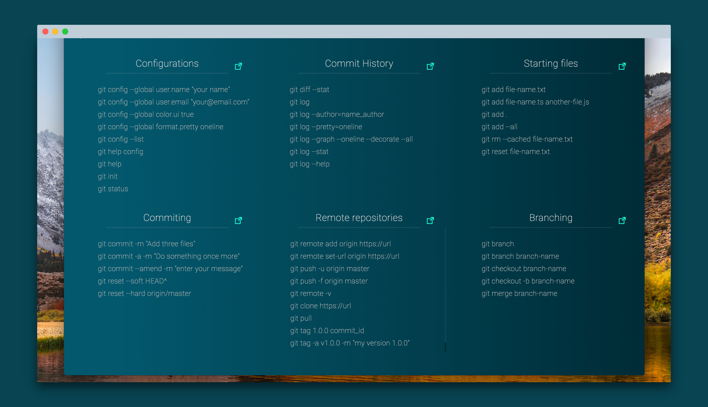

[](https://github.com/mariorodeghiero/git-commands/tags)
[](http://opensource.org/licenses/MIT)

# Git Commands

Git Commands is a desktop app built with ElectronJS and ReactJS to be cross-platform, providing quick access to the main Git commands and with direct links to the documentation.

## Screenshot



**Note!!** You can download the App for **Mac** and **Windows** in [Git Commands](https://mariorodeghiero.com/git-commands/).

## Built With

* [ReactJS](https://reactjs.org) - ReactJS
* [ElectronJS](https://electronjs.org) - ElectronJS
* [electron-react-boilerplate](https://github.com/chentsulin/electron-react-boilerplate) - electron-react-boilerplate

## Prerequisites

* **Requires a node version >= 7 and an npm version >= 4.**
* **If you have installation or compilation issues with this project, please see [our debugging guide](https://github.com/mariorodeghiero/git-commands/issues/2)**

## Install

First, clone the repo via git:

```bash
git clone --depth=1 https://github.com/mariorodeghiero/git-commands.git your-project-name
```

And then install dependencies with yarn.

```bash
$ cd your-project-name
$ yarn
```

**Note**: If you can't use [yarn](https://github.com/yarnpkg/yarn), run `npm install`.

## Run

Start the app in the `dev` environment:

```bash
$ npm run dev
```

## Packaging

To package apps for the local platform:

```bash
$ npm run package
```

To package apps for all platforms:

First, refer to [Multi Platform Build](https://www.electron.build/multi-platform-build) for dependencies.

Then,

```bash
$ npm run package-all
```

To package apps with options:

```bash
$ npm run package -- --[option]
```

To improve the usability of this App, you can create keyboard shortcuts to start quickly.

* For Mac_OS use "Automator".
* For Windows access "Properties" of the App.

## Contributing

Please read [CONTRIBUTING.md](CONTRIBUTING.md) for details on our code of conduct, and the process for submitting pull requests to us.

## Author

* [Mário Antônio do Amaral Rodeghiero](https://github.com/mariorodeghiero)

## License

This project is licensed under the MIT License - see the [LICENSE.md](LICENSE.md) file for details
